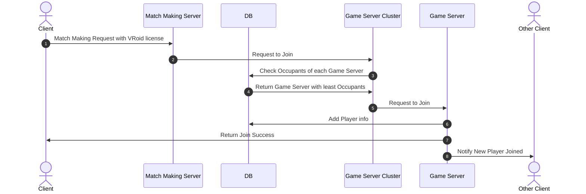
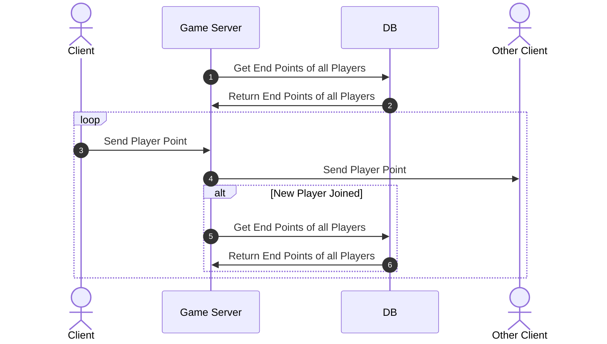
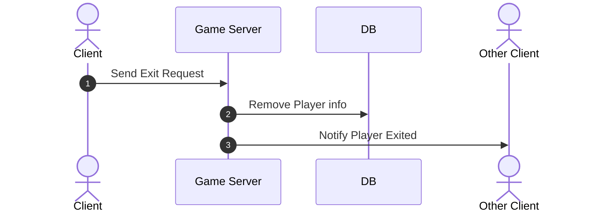

# About

This is a document for VIRCE server.

# Role Of Each Object

## Client

- Client is a player who wants to play the game.
- Client sends request to Match Making Server to join the game.

## Match Making Server

- Match Making Server is a server that receives match making request from client and throw it to Game Server Cluster.

## Game Server Cluster

- Game Server Cluster is a server that receives request from Match Making Server and throw it to Game Server.
- Game Server Cluster also checks the number of occupants of each Game Server and return the Game Server with least
  occupants.
- Game Server Cluster is also responsible for load balancing.

## Game Server

- Game Server is a server for relaying the data between clients.
- Game Server is also responsible for notifying other clients when a new player joined or a player exited.

## Database

- Database is a server that stores the information of each player.
- Database is also responsible for storing the information of each Game Server.

# Sequence Diagram

## Match Making

## On Frame

## On Exit

